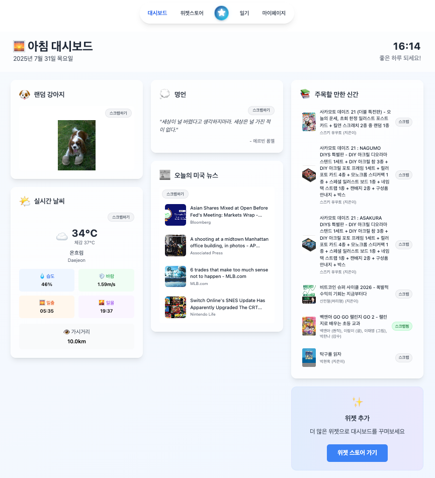
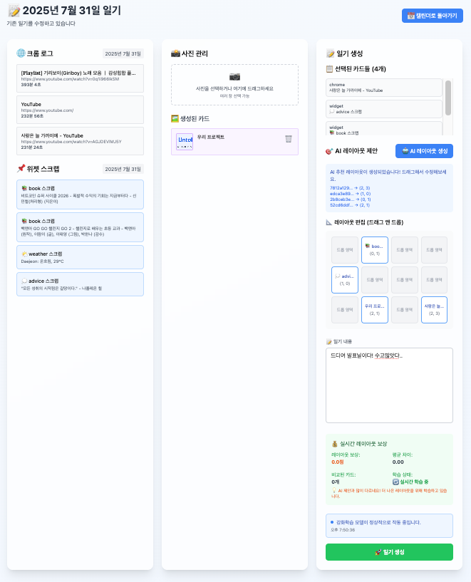

# UnTold - 나도 몰랐던 나를 아는 방법

## 📖 프로젝트 개요

UnTold은 사용자의 일상적인 디지털 활동(웹 브라우징, 위젯 사용, 일기 작성)을 통합하여 개인화된 일기 생성과 감정 분석을 제공하는 AI 기반 일기 플랫폼입니다.

<br><br>

## 🎯 개발 동기

### 문제 인식
- **일기 작성의 어려움**: 많은 사람들이 일기를 쓰고 싶지만 시작하기 어렵거나 지속하기 어려워함
- **디지털 흔적의 방치**: 브라우징 기록, 관심사 등이 체계적으로 정리되지 않음
- **감정 인식의 부족**: 자신의 감정 상태를 객관적으로 파악하기 어려움
- **개인화 부족**: 기존 일기 앱들은 개인별 특성을 고려하지 않는 일반적인 기능 제공

### 해결 방향
- **자동화된 일기 생성**: 사용자의 디지털 활동을 기반으로 일기 초안 자동 생성
- **감정 분석 통합**: Russell의 2D 감정 모델을 활용한 정확한 감정 상태 매핑
- **개인화된 경험**: 강화학습을 통한 사용자 맞춤형 레이아웃 제안
- **직관적인 인터페이스**: 드래그 앤 드롭 방식의 쉬운 일기 편집

<br><br>

## 👥 타겟 사용자

### 주요 대상
- **일기 작성에 관심이 있는 모든 연령대**: 20-40대 주 타겟
- **디지털 네이티브**: 온라인 활동이 많은 사용자
- **자기 성찰에 관심 있는 사용자**: 감정 상태 파악과 개인 성장에 관심


<br><br>

## 🚀 주요 기능

### 🔐 인증 시스템
- **카카오 로그인**: OAuth 기반 소셜 로그인
- **Google 로그인**: OAuth 기반 소셜 로그인
- **GitHub 로그인**: OAuth 기반 소셜 로그인

### 📊 아침 대시보드
- **날씨 위젯**: 실시간 날씨 정보 및 체감 온도
- **뉴스 위젯**: 최신 뉴스 헤드라인 및 썸네일
- **NASA 위젯**: 우주 사진 및 천문학 정보
- **명언 위젯**: 랜덤 한국어 명언
- **주식 위젯**: 실시간 주식 정보 및 변동률
- **음악 위젯**: 추천 음악 플레이리스트
- **고양이 위젯**: 랜덤 고양이 사진
- **강아지 위젯**: 랜덤 강아지 사진
- **책 추천 위젯**: 개인화된 책 추천 


### 📝 자동 일기 생성
- **AI 기반 초안 생성**: 사용자 감정 기반 맞춤형 일기
- **강화학습 개선**: 사용자 피드백 기반 모델 개선
- **멀티모달 통합**: 브라우징 로그, 위젯 스크랩, 사용자 입력 통합

### 🔄 통합 데이터 수집
- **Chrome Extension**: 브라우징 활동 자동 수집 및 분석
- **위젯 스크랩**: 관심 있는 정보를 일기 소재로 활용
- **사용자 입력**: 직접적인 일기 텍스트 작성 및 사진 업로드

### 🧠 개인화 및 학습
- **사용자 피드백 학습**: 사용자의 수정 패턴을 학습하여 개선
- **감정 트렌드 분석**: 시간에 따른 감정 변화 추적 및 시각화
- **맞춤형 추천**: 개인별 관심사와 패턴 기반 콘텐츠 추천
- **MyPage 대시보드**: 개인 활동 통계 및 스크랩 관리

### 🎨 직관적인 편집 인터페이스
- **카드 기반 편집**: 드래그 앤 드롭 방식의 직관적인 일기 편집
- **실시간 미리보기**: 변경사항을 즉시 확인 가능
- **개인화된 레이아웃**: 강화학습 기반 사용자 맞춤형 레이아웃 제안

### 🧠 2D 감정 분석
- **Valence (긍정성)**: -1 ~ 1 (부정적 ~ 긍정적)
- **Arousal (활성도)**: -1 ~ 1 (낮은 활성도 ~ 높은 활성도)
- **9가지 감정 레이블**: excited, calm, pleasant, angry, sad, unpleasant, tense, relaxed, neutral
- **Russell 모델 기반**: 검증된 2차원 감정 분석

<br><br>

## 🛠 사용 기술

### Frontend
- **Next.js 13**: React 기반 풀스택 프레임워크
- **TypeScript**: 타입 안정성과 개발 생산성 향상
- **Tailwind CSS**: CSS 프레임워크
- **Axios**: HTTP 클라이언트

### Backend
- **FastAPI**: Python 웹 프레임워크
- **Uvicorn**: ASGI 서버
- **Pydantic**: 데이터 검증 및 직렬화

### Database
- **Supabase**: PostgreSQL 기반 백엔드 서비스
  - 실시간 데이터 동기화
  - OAuth 인증 통합
  - RESTful API 자동 생성

### AI/ML Stack

#### 🧠 딥러닝 프레임워크
- **PyTorch 2.x**: 딥러닝 모델 구축 및 학습을 위한 핵심 프레임워크
  - 동적 계산 그래프 지원
  - GPU 가속 연산
- **Transformers (Hugging Face)**: 사전학습된 언어 모델 활용 라이브러리
  - 모델 로드, 토크나이징, 파인튜닝 기능 제공
  - 통합 API로 다양한 모델 일관성 있게 사용

#### 😊 감정 분석 모델
- **intfloat/multilingual-e5-large-instruct**: 다국어 임베딩 모델
  - 1024차원 텍스트 임베딩 생성
  - 한국어 문장 의미 벡터화
- **KOTE Dataset**: 한국어 온라인 댓글 감정 분석 데이터셋
  - 9,000개 문장, 44개 감정 레이블
  - Valence/Arousal 점수로 변환하여 학습
- **scikit-learn**: 모델 평가 지표 계산 (MAE, MSE)

#### 🎯 강화학습 모델
- **PPO (Proximal Policy Optimization)**: PyTorch 기반 직접 구현
  - Actor-Critic 신경망 구조
  - 정책 경사 방법으로 레이아웃 최적화
- **NumPy**: 상태/행동 벡터 및 보상 계산 처리

#### ✍️ 텍스트 생성 모델
- **EleutherAI/polyglot-ko-1.3b**: 한국어 특화 언어 모델
  - 13억 개 파라미터
  - GPT 아키텍처 기반
- **PEFT (Parameter-Efficient Fine-Tuning)**: LoRA 구현 라이브러리
  - 저차원 어댑터 행렬 학습
  - 전체 모델의 0.02%만 학습하여 메모리 효율성 확보
- **bitsandbytes**: 4-bit 양자화 지원
  - 모델 크기 75% 감소
  - GPU 메모리 사용량 최소화

#### 🛠️ 모델 관리 및 배포
- **Hugging Face Hub**: 모델 버전 관리 및 공유 플랫폼
  - 학습된 모델 원격 저장
  - 자동 다운로드 기능
- **safetensors**: 안전한 모델 직렬화 포맷
  - 빠른 로딩 속도
  - 보안 취약점 최소화

<br><br>

## 🧠 기술적 의도와 원리

### 1. 2D 감정 분석 모델
**Russell의 감정 모델**을 기반으로 한 2차원 감정 분석을 구현했습니다.

#### 원리
- **Valence (가치)**: -1 (부정적) ~ +1 (긍정적)
- **Arousal (각성)**: -1 (낮은 각성) ~ +1 (높은 각성)

#### 감정 매핑
```
Valence > 0.2:
  Arousal > 0.2: excited (흥분)
  Arousal < -0.2: calm (평온)
  else: pleasant (즐거움)

Valence < -0.2:
  Arousal > 0.2: angry (분노)
  Arousal < -0.2: sad (슬픔)
  else: unpleasant (불쾌)

else:
  Arousal > 0.2: tense (긴장)
  Arousal < -0.2: relaxed (이완)
  else: neutral (중립)
```
<br>

### 2. 강화학습 기반 레이아웃 최적화
사용자의 피드백을 학습하여 개인화된 일기 레이아웃을 제안합니다.

#### 상태 공간 (State Space)
- 선택된 카드들의 특성
- 이전 레이아웃 패턴

#### 행동 공간 (Action Space)
- 카드별 위치 배치 (row, col)
- 카드 순서 결정
- 레이아웃 스타일 선택

#### 보상 함수 (Reward Function)
- 사용자 만족도 (save: +100, modify: -20, regenerate: -50)
- 레이아웃 일관성

<br>

### 3. 멀티모달 데이터 통합
다양한 소스의 데이터를 통합하여 의미 있는 일기를 생성합니다.

#### 데이터 소스
1. **Chrome 브라우징 로그**: 방문한 웹사이트, 체류 시간
2. **위젯 스크랩**: 날씨, 뉴스, 명언, 책 정보 등
3. **사용자 직접 입력**: 일기 텍스트, 사진, 설명

#### 통합 프로세스
1. **데이터 전처리**: 정규화 및 클리닝
2. **특성 추출**: 텍스트 임베딩, 메타데이터 분석
3. **관련성 계산**: 사용자 관심사와의 연관성
4. **일기 생성**: 통합된 정보를 바탕으로 일기 초안 생성

 <br><br>

## 🔄 시스템 파이프라인

### 1. 데이터 수집 단계
```
Chrome Extension → Supabase (chrome_logs)
Widget Scrap → Supabase (scraps)
User Input → Frontend State
```

### 2. 일기 생성 단계
```
1. 데이터 통합
   ↓
2. 일기 초안 생성
   ↓
3. 레이아웃 제안 (RL Model)
   ↓
4. 사용자 편집
   ↓
5. 피드백 학습
```
<br><br>

## 🤖 AI 모델 상세

### 1. 감정 분석 모델 (2D Emotion Regression)

#### 💡 역할
일기 텍스트를 분석하여 감정을 2차원 좌표로 표현합니다.
- **Valence (긍정도)**: -1(부정) ~ +1(긍정)
- **Arousal (활성도)**: -1(낮음) ~ +1(높음)

**예시**:
- "친구들과 놀이공원 가서 즐거웠어!" → valence: 0.9, arousal: 0.8 (신남)
- "비 와서 집에서 조용히 쉬었다" → valence: 0.6, arousal: -0.3 (평온)

#### 🎓 학습 방법
1. **데이터셋**: KOTE (한국어 감정 데이터 9,000개)
   - 44개 감정 레이블을 Valence/Arousal 점수로 변환
2. **기반 모델**: multilingual-e5-large (한국어 사전학습 모델)
3. **학습 과정**: 
   ```bash
   cd back/ml
   python preprocess_data.py  # 데이터 변환
   python train_emotion_regressor.py  # 모델 학습 (1-2시간)
   ```

#### 📦 배포
- Hugging Face Hub: `kjy8402/untold-2d-emotion-model`
- 로컬에 없으면 자동 다운로드

---

### 2. 강화학습 모델 (Layout Optimization)

#### 💡 역할
사용자가 선택한 카드들을 3×4 그리드에 최적으로 배치합니다.

#### 🎮 학습 원리
**보상 함수 설계**:
- 사용자가 그대로 저장 → +100점
- 레이아웃 수정 → -50점
- 재추천 요청 → -100점

PPO 알고리즘을 통해 누적 보상을 최대화하는 정책을 학습합니다.

#### 🧠 학습 과정
```
1. 과거 데이터 수집
   - Supabase에서 사용자 일기 작성 로그 조회
   - AI 추천 레이아웃과 최종 레이아웃 비교

2. 에피소드 구성
   - 각 일기 작성 세션을 하나의 에피소드로 변환
   - 상태-행동-보상 시퀀스 생성
   - 카드 배치 순서별 트랜지션 기록

3. 정책 업데이트
   - GAE(Generalized Advantage Estimation)로 이점 계산
   - Actor 네트워크: 배치 확률 분포 출력
   - Critic 네트워크: 상태 가치 함수 학습
   - 주기적 재학습으로 성능 개선
```

#### 🚀 실행
```bash
cd back/rl_core
python train_script.py  # 최소 100개 일기 로그 필요
```

#### 고려 요소
- 사용자 과거 만족도
- 카드 특성 (이미지/텍스트)
- 그리드 상태

---

### 3. LoRA 파인튜닝 (Diary Generation)

#### 💡 역할
브라우징 기록, 위젯 스크랩, 사용자 입력을 바탕으로 일기 초안을 생성합니다.

**예시**:
```
입력: 뉴스(벚꽃 개화), 방문(여행 블로그), 날씨(맑음 20도)
→ AI 생성: "오늘은 날씨가 좋았다. 벚꽃 소식을 보고 여행 가고 싶었다..."
```

#### 💪 LoRA 파인튜닝 방식
- **일반 파인튜닝**: 모델 전체(13억 파라미터) 업데이트
  - 높은 GPU 메모리 요구(40GB+)
  - 학습 시간 24시간 이상
- **LoRA 방식**: 저차원 어댑터 행렬만 학습
  - 학습 파라미터: 약 300만 개(0.02%)
  - GPU 메모리: 8-12GB로 충분
  - 학습 시간: 2-3시간

#### 🔧 학습 과정
```bash
cd lora/scripts

# 1. 데이터 수집 (최소 50개 일기)
python prepare_training_data.py

# 2. 학습 (2-3시간)
python train_lora.py  # GPU
python train_lora_minimal.py  # CPU

# 3. 일기 생성 테스트
python generate_diary.py
```

#### 📝 개인화 메커니즘
- 사용자별 작문 패턴 학습 (문장 구조, 어휘 선택)
- Valence/Arousal 값에 따른 감정 표현 조정
- 입력 컨텍스트(뉴스, 브라우징, 스크랩)를 자연스러운 문장으로 통합

---

### 📊 통합 동작 흐름

```
사용자 일기 작성
    ↓
[감정 분석] → 과거 감정 트렌드 파악
    ↓
[LoRA] → 오늘 데이터로 일기 초안 생성
    ↓
[강화학습] → 카드 레이아웃 최적 배치
    ↓
사용자 확인 & 저장
    ↓
[피드백 학습] → 다음 추천 개선
```

<br><br>

## 📊 데이터베이스 스키마

### 핵심 테이블
1. **users**: 사용자 정보
2. **diaries**: 일기 메타데이터 및 감정 벡터
3. **cards**: 일기 구성 요소 (위젯, 크롬 로그, 사진)
4. **scraps**: 스크랩된 위젯 정보
5. **chrome_logs**: 브라우징 활동 로그
6. **layout_logs**: 레이아웃 변경 이력
7. **reward_logs**: 사용자 피드백 및 보상

<br>

---

# 📸 주요 화면 (Main Screens)

| 화면 | 설명 | 이미지 |
| :---: | :---: | :---: |
| **로그인 화면** | 카카오/Google/GitHub 소셜 로그인 제공 |  |
| **대시보드** | 날씨, 뉴스, 주식 등 다양한 위젯을 개인화하여 볼 수 있는 메인 화면 |  |
| **위젯 편집** | 사용자가 원하는 위젯을 선택하고 배치하여 맞춤형 대시보드를 구성 |  |
| **일기 작성** | AI가 생성한 일기 초안을 기반으로 사용자가 직관적으로 편집하는 화면 |  |
| **감정 캘린더** | 2D 감정 분석 결과를 시각화하여 감정 변화 트렌드를 한눈에 파악 |  |

<br>

---

<br>

**UnTold** - 당신의 일상이 특별한 이야기가 되는 순간 ✨
